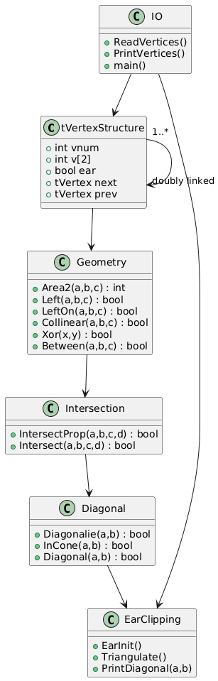

# 🧩 Polygon Triangulation Visualisation Suite  
### C Implementation + Full Python Interactive Visualisers  
#### Based on “Computational Geometry in C” — Joseph O’Rourke  

---

  

> **Interactive learning + classic geometry algorithms combined.**  
> Triangulation, left-test, segment intersection, cone test, and ear detection — all animated.

---

# 📌 Overview

This repository implements **polygon triangulation** using the **ear-clipping algorithm** in C and includes multiple interactive Python visualisers that help you understand every computational geometry concept used inside the triangulation algorithm.

✔ Understand **orientation tests**  
✔ Learn **segment intersection**  
✔ Visualise **InCone test**  
✔ Watch **ear detection** live  
✔ See full triangulation step-by-step  

The project breaks the complex logic of computational geometry into **simple, visual, beginner-friendly tools.**

---

# 📁 Project Structure
📦 triangulation-project/
### ┣ triangulate.c → Main triangulation implementation (C)
### ┣ triangulate → Compiled executable (generated)
### ┣ poly.txt → Polygon input coordinates
### ┣ live_visualiser.py → Full triangulation visualiser
### ┣ left_test_visualiser.py → Orientation/Left test visualiser
### ┣ segment_intersection_visualiser.py → Segment intersection visualiser
### ┣ incone_visualiser.py → InCone geometry visualiser
### ┣ ear_detection_visualiser.py → Ear clipping visualiser
### ┗ README.md → This documentation

All visualisers are **fully interactive** — drag points, move segments, watch geometry update live.

---

# 🚀 Features

### ✔ Full ear-clipping triangulation  
### ✔ Real-time Python animation (Matplotlib)  
### ✔ Geometry concept visualisers  
### ✔ Clean C implementation with event streaming  
### ✔ Works on macOS / Linux / Windows  

---

