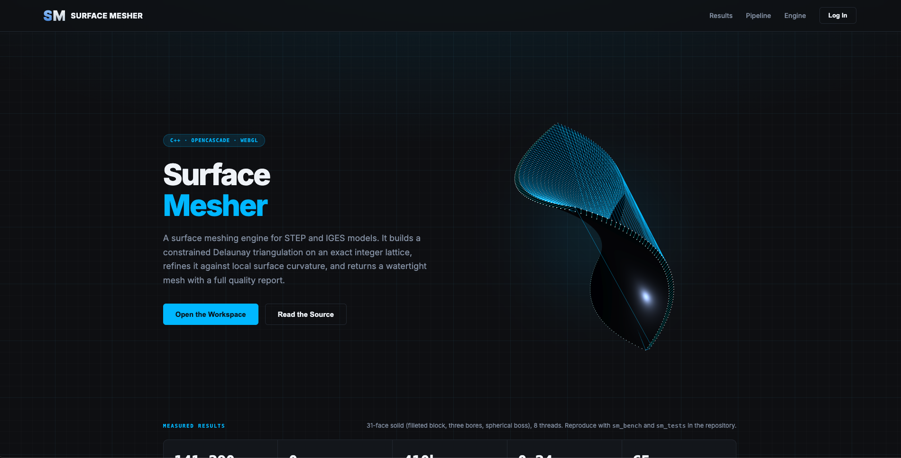
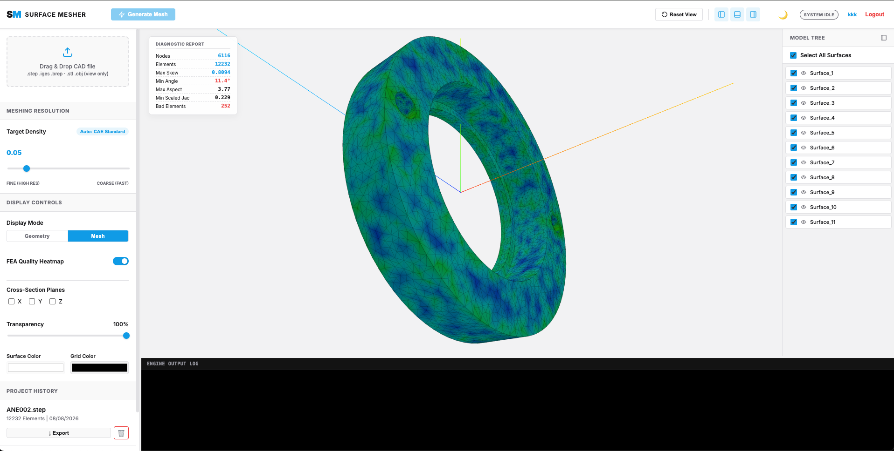
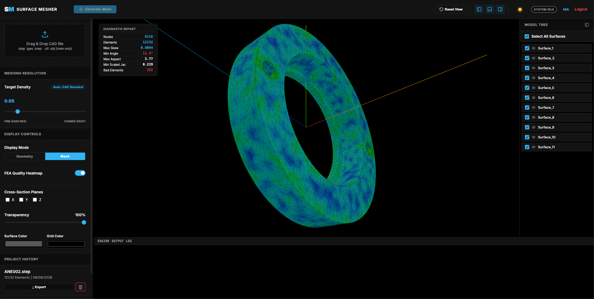
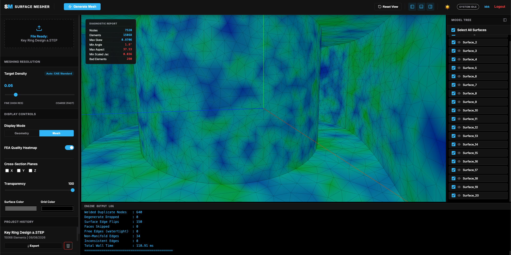
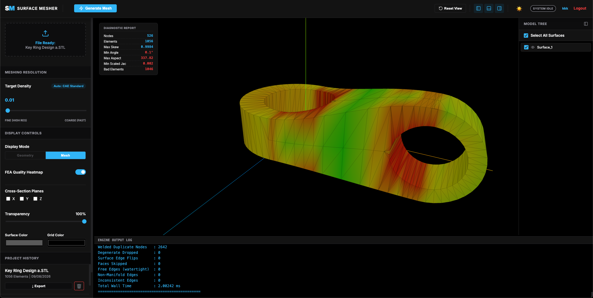
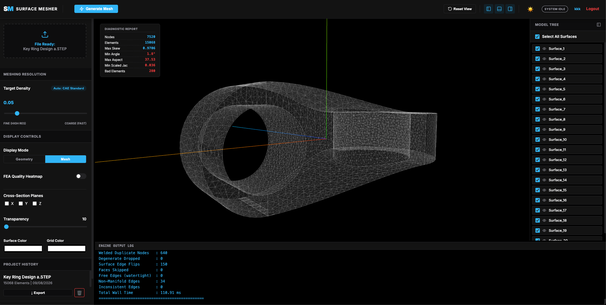
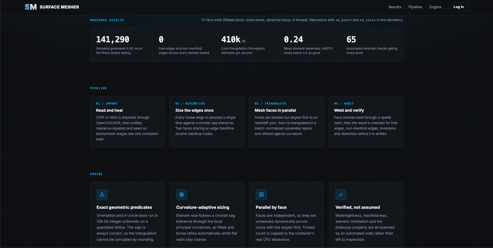

<div align="center">

# Surface Mesher

**A CAD surface meshing engine written from scratch in C++.**

Drop in a STEP file, get back a watertight triangle mesh — and an honest report
on how good it is.

### [→ Open the app](https://mesh-stage.vercel.app) &nbsp;·&nbsp; [API](https://swostideep-mesh-stage-api.hf.space/health) &nbsp;·&nbsp; [Engine source](sm_engine)

`C++17` &nbsp;·&nbsp; `OpenCASCADE` &nbsp;·&nbsp; `OpenMP` &nbsp;·&nbsp; `Node.js` &nbsp;·&nbsp; `Three.js`



</div>

<br>

## ▶ Watch it run

**[Play the demo](DEMO_VIDEO_URL)** — upload a CAD file, mesh it, read the
quality heatmap, flip between source geometry and generated mesh, export.

<br>

---

## The workspace

Upload on the left, 3D viewport in the middle, per-surface model tree on the
right, live engine log along the bottom. The floating card is the diagnostic
report — it updates the moment a mesh finishes.



> A 12,232-element mesh of a torus. Blue is a well-shaped element, green is
> acceptable. Minimum angle 11.4°, aspect ratio 3.77 — a healthy mesh. Every
> surface in the model is listed on the right and can be hidden individually.



> Same mesh, dark theme. The viewport, panels and console all follow the theme.

<br>

## Element size follows curvature

Zoomed into a bore. Sizing is driven by a chordal sag tolerance rather than a
fixed edge length, so curvature earns finer elements automatically — the wall of
the bore is denser than the flat around it, without anyone asking for it.



> 15,068 elements. Note `Non-Manifold Edges: 34` in the log — a real defect in
> this particular model, surfaced rather than swallowed.

<br>

## The part where it tells you the truth

This is the same physical part, meshed twice. Left is what the engine produces
from the **STEP** file. Right is what you get when you feed it the **STL** the
same CAD system exported.



> Minimum angle **0.1°**, aspect ratio **338**, scaled Jacobian **0.002**, and
> **1046 of 1056** elements flagged. Red is a degenerate sliver.
>
> The engine did not create this. An STL arrives already triangulated, so there
> is no surface left to sample and nothing to refine — it is faithfully
> reporting the tessellation the exporter produced. Mesh the STEP version of
> the same part and the elements come out an order of magnitude better.
>
> Plenty of tools will hand you a mesh. Being able to see *this* difference is
> the entire argument for measuring rather than assuming.

<br>

## Under the surface

Heatmap off, transparency down to 10% — the wireframe shows the whole
triangulation at once, including the interior walls of the bores.



> Twenty separate CAD faces, meshed independently in parallel and welded into
> one shell. `Free Edges: 0` is what says the weld held.

<br>

## Measured, not claimed



A 31-face solid — filleted block, three through bores, spherical boss — on 8
threads. `Free edges` counts mesh edges used by only one triangle, so zero means
the shell is closed.

| Density | Nodes  | Elements | Free edges | Non-manifold | Mean skew | Wall time |
|--------:|-------:|---------:|-----------:|-------------:|----------:|----------:|
| 0.20    |  2,033 |    4,070 |          0 |            0 |      0.29 |     55 ms |
| 0.12    |  4,413 |    8,830 |          0 |            0 |      0.29 |     27 ms |
| 0.08    | 10,175 |   20,354 |          0 |            0 |      0.27 |     30 ms |
| 0.05    | 20,014 |   40,032 |          0 |            0 |      0.26 |     39 ms |
| 0.03    | 40,713 |   81,430 |          0 |            0 |      0.25 |     59 ms |
| 0.02    | 70,643 |  141,290 |          0 |            0 |      0.24 |     92 ms |

The core triangulator on its own, meshing a 24-tooth gear profile with a bore:

| Target edge | Elements | Time      | Elements/s |
|------------:|---------:|----------:|-----------:|
|        4.00 |    7,899 |     23 ms |    349,330 |
|        2.00 |   32,048 |     92 ms |    347,599 |
|        1.00 |  128,669 |    500 ms |    257,373 |
|        0.35 |  794,618 |  9,016 ms |     88,134 |

Reproduce both with `sm_bench` and `sm_tests`. Nothing here is estimated.

<br>

---

<br>

## How it works

**1 · Import and heal.** `ShapeUpgrade_UnifySameDomain`, `ShapeFix_Shape` and
`BRepBuilderAPI_Sewing` normalise the incoming shape so every later stage sees
one consistent shell.

**2 · Size the edges once, globally.** Every model edge is sampled a single time
against a chordal sag tolerance, then densified so no boundary segment exceeds
the target size. Because both faces sharing an edge read the same sample list,
their boundaries match node for node — which is what makes the final weld
watertight instead of cracked.

**3 · Triangulate faces in parallel.** Faces are independent, so they go to an
OpenMP pool largest-first with dynamic scheduling; face cost varies by orders of
magnitude and a static split leaves cores idle behind one straggler. Each face is
meshed in a parameter space rescaled by local surface stretch, so element quality
is optimised for the real 3D triangle rather than for the parametrisation's
distortion of it.

**4 · Weld and audit.** Face meshes merge through a spatial hash, then the result
is checked for free edges, non-manifold edges, winding consistency and element
quality before anything is written.

### Inside the triangulator

- **Exact predicates.** Orientation and in-circle tests run in `__int128` on a
  2²² integer lattice, with an overflow budget worked out in the header so no
  input can exceed it. The predicates return the true sign, not a rounded one, so
  the triangulation cannot be corrupted by floating-point error.
- **Insertion order.** Points go in as biased randomised rounds, Hilbert sorted
  within each round, so consecutive insertions land near each other and the
  location walk terminates in a couple of steps.
- **Constraints.** Segments are inserted by retriangulating the strip of
  triangles they cross (Anglada), not by subdividing until an edge appears.
- **Refinement.** Ruppert refinement from a priority queue, worst element first.
  Encroachment is answered from a uniform grid over segment diametral circles, so
  the query is O(1) rather than a scan over every segment.
- **Domain classification.** Inside and outside are separated by a crossing
  parity flood — each constrained edge crossed toggles the state. A fill that
  merely stops at the boundary cannot reach an interior hole, and would leave
  every bore packed with elements.

### The trade worth knowing about

Face boundaries are **frozen** during refinement. Two adjacent faces are meshed
independently, so if either were allowed to subdivide its share of their common
edge, the two boundaries would stop matching and the weld would leave a crack.

The cost is that the worst elements sit against those frozen boundaries. The
interior holds around 30°, but a real model's global minimum angle lands closer
to 7°. That is watertightness bought with some boundary-adjacent angle quality,
and it is a deliberate choice rather than an accident.

<br>

## Reading the quality report

| Metric | Meaning |
|---|---|
| **Min angle** | Smallest interior angle anywhere in the mesh. Below 20° starts to hurt solver conditioning. |
| **Max aspect** | Verdict/CUBIT aspect ratio. 1.0 is equilateral, unbounded as elements flatten. |
| **Min scaled Jacobian** | 1.0 equilateral, 0 degenerate, negative means inverted. |
| **Free edges** | Edges used by one triangle. Non-zero means the shell has a hole. |
| **Non-manifold edges** | Edges shared by three or more triangles. |
| **Inconsistent edges** | Neighbouring triangles disagreeing about which side is outward. |

**Why aspect ratio and not `maxEdge/minEdge`.** The obvious edge-ratio metric
never looks at area, so a triangle with edges 1, 1, 1.99 — which hides a 168°
angle and is useless to a solver — still scores 1.99 and passes. The Verdict form
catches it. There is a test pinning exactly that case, asserting both that aspect
ratio flags it and that the edge ratio would not have.

**On the scaled Jacobian.** Worth being straight about: for a *triangle*,
`det(J)` is `2·area` at every corner, so the scaled Jacobian reduces to
`(2/√3)·sin(minAngle)`. Its magnitude tells you nothing the minimum angle does
not. It is reported for its *sign*, which detects inversion, and because solver
pre-checks ask for it by name. Quads and tets are where the magnitude carries
real information. That identity is asserted over a thousand random triangles in
the test suite, which conveniently cross-checks two independently written code
paths against each other.

<br>

## Against the previous core

The original triangulator, timed on the same machine with the same input,
sustained about **2,700 elements/second** and could not exceed roughly 2,500
elements, because refinement was capped at 1,500 Steiner points. It also returned
an empty mesh for a 16-gon without reporting an error.

The current core sustains **250,000–350,000 elements/second** with no comparable
ceiling. The gap is algorithmic, not micro-optimisation:

| Operation | Before | After |
|---|---|---|
| Point location | Scan every triangle, including dead ones | Visibility walk from the last insertion, Hilbert-ordered input |
| Cavity construction | Scan all triangles, then O(k²) edge dedup | Depth-first from the containing triangle, proportional to the cavity |
| Constraint insertion | Split segments until the edge happens to appear | Retriangulate the crossed strip once |
| Adjacency | Rebuilt from a `std::map` every refinement step | Maintained incrementally as half-edge indices |
| Edge flipping | Restart the scan and rebuild after every flip | Flip stack, only affected edges revisited |
| Delaunay audit | O(triangles × vertices) in-circle tests | O(triangles), one test per shared edge |
| Dead triangles | Never reclaimed | Free list |

<br>

## Supported formats

| Format | Extension | Treatment |
|--------|-----------|-----------|
| STEP | `.step` `.stp` | Meshed. Curvature-adaptive, density applies. |
| IGES | `.iges` `.igs` | Meshed. Curvature-adaptive, density applies. |
| BREP | `.brep` `.brp` | Meshed. OpenCASCADE's native serialisation. |
| STL | `.stl` | View only. Binary and ASCII. |
| OBJ | `.obj` | View only. |

STEP, IGES and BREP carry boundary representation — trimmed surfaces with
topology — which is what the mesher consumes, so it can sample them at any
requested density.

STL and OBJ arrive already triangulated. The surface the mesher would sample is
gone, so density has nothing to act on and they are passed through as authored.
They are still worth accepting: welding them (an STL repeats every shared vertex
once per touching triangle, so the raw file has no connectivity at all) and
running the same audit answers the question people usually have about a
downloaded STL — is it watertight, is it manifold, how bad are the elements.

**Not supported:** SLDPRT, Parasolid and ACIS are closed formats needing a
commercial kernel, which is a licensing wall rather than a missing feature —
every one of those CAD systems exports STEP natively. `.blend` holds polygons
rather than trimmed NURBS, so there is nothing there to mesh; export OBJ or STL
and use the view-only path.

<br>

## Building

The core library has no OpenCASCADE dependency, so it and its tests build on a
machine with nothing but a compiler.

```bash
cmake -S sm_engine -B build -DCMAKE_BUILD_TYPE=Release
cmake --build build -j
./build/sm_tests      # 97 invariant checks
./build/sm_bench 24   # throughput sweep
```

With OpenCASCADE present, the CAD front end builds too:

```bash
./build/voronoi_mesh part.step 0.05 out.obj
./build/voronoi_mesh scan.stl  0.05 out.obj   # view-only passthrough
```

Exit status is `0` on success, `1` when the file cannot be read or produces no
elements, `2` for a bad invocation.

### Running the whole thing locally

```bash
cd sm_backend && npm install && node server.js     # API on :7860
cd sm_frontend && python3 -m http.server 5173      # UI  on :5173
```

No configuration needed — without `MONGODB_URI` it uses an in-memory store and
without `REDIS_URL` an in-process queue, so a fresh clone runs as-is. Deployment
notes are in [DEPLOY.md](DEPLOY.md).

<br>

## Testing

`sm_tests` asserts structural invariants rather than golden output, so the tests
keep their meaning as the refinement heuristics are tuned:

- no inverted or zero-area elements
- every edge in at most two triangles, and traversed once in each direction
- the mesh boundary is exactly the input boundary
- Euler characteristic matches a disc or an annulus as appropriate
- metric anchors: equilateral scores exactly 1.0, closed forms hold to 1e-12
- metrics are scale- and permutation-invariant, and the lattice and 3D paths agree

`sm_bench` exits non-zero if it detects inverted elements, Delaunay violations or
a degenerate scaled Jacobian. It gates on correctness only — a wall-clock
threshold on shared hardware just teaches everyone to ignore the result.

<br>

## Layout

```
sm_engine/     C++ meshing engine
  include/sm/  predicates, geometry, half-edge mesh, public API
  src/         triangulator, refinement, smoothing and flips, audit
  cad/         OpenCASCADE front end and CLI
  tests/       invariant suite
  bench/       throughput benchmark
sm_backend/    Node/Express job API, queue, storage, auth
sm_frontend/   Three.js workspace and landing page
```
